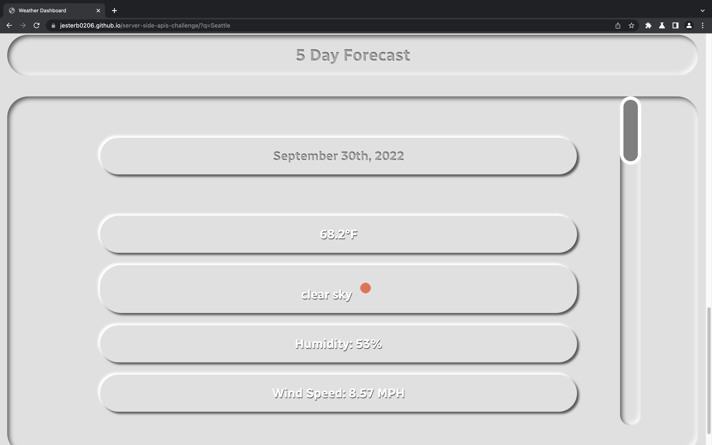

# Weather Dashboard 

## Description

Third-party APIs allow developers to access their data and functionality by making requests with specific parameters to a URL. Developers are often tasked with retrieving data from another application's API and using it in the context of their own. As I hadn't had practice using server-side APIs up until this point, my motivation for creating this web application was to begin practicing interacting with, and using, them in my web applications and web pages/web sites. I decided to build this project because I also wanted an opportunity to practice UI/UX design concepts that I had just read about online. This web application helps travelers plan what outfits to pack for their trips by seeing future weather conditions for their destination city. It also helps people who need to plan their days around the weather or those who just want to see the current or future weather conditions for their city or another city of their choosing. During the creation of this web application I learned all about neumorphic design. Using box and text shadows, designers and developers can make elements appear as if they're sinking or protruding from the page. This style is all about using a minimal color palette, low contrast and the right amount of shadowing in the UI design. In order to curb some of the accessibility issues that comes with this style I made sure to use the appropriate cursor style for the given context. I also played around with the hover, focus and active states of different HTML elements. I couldn't use differing colors or high color contrast to signal to the user that a button had been pressed or to guide the user in general, so I had to make up for it by getting creative on how I would guide and inform the user on how to interact with my web application. These self-imposed strict limitations helped me to grow my UI/UX design skills this week.

## Installation

N/A

## Usage

A few thing to note: 

- To search for a city hover your mouse over the Enter a City form area or click on it if you're using a mobile or tablet device. You'll know that it's safe to click on the form area if the Enter a City placeholder text becomes engraved (for Mac or PC users). Once the placeholder text disappears you can begin typing the name of the city whose weather you wish to see. When you're ready to see that city's weather just click on the Search button (or hover on it for Mac or PC users and click and release the button, you'll see that the box shadow of the button becomes inset and appears sunken when hovered over). When you press the Search button the Enter a City placeholder text reappears and the name of the city populates in the search area as a clickable button that's saved to local storage. If you view another city's weather but would like to see the weather of a city you previously viewed just click the auto generated button that populated in the search area before that corresponds to that city. If you click on the Clear button (or hover on it for Mac or PC users and click and release the button) the web application reloads and all previously generated city buttons disappear from local storage. All clickable buttons have an inset box shadow, engraved text and a pointer cursor when hovered over on Mac or PCs. When you hold down your mouse on the clickable buttons (for Mac or PC users) a wait cursor appears until the button is released. All non-clickable elements that a user could mistake for being interactive have a cursor not-allowed when hovered over. Lastly, any section of the web application that has content that spills vertically outside of it's container (or content that spills vertically outside of it's container when a certain number of city buttons have populated the search area) will have a scroll bar on the right hand side that's unique to that section's container.

- When you search for a city's weather you can see the current forecast in a unique container upon scrolling down. In that container you'll see the name of the city whose weather you just searched for, the current date, the current temperature in degrees fahrenheit, the current conditions, an icon representation of the current conditions, the humidity percentage, the wind speed in miles per hour, and the UV Index which is color coded to represent if it's a high or low value.

- When you continue scrolling down you'll see a 5 Day Forecast container that contains the date of each of the next 5 days, that day's forecasted high temperature, forecasted conditions with an icon representation of those conditions, the forecasted high humidity percentage and the forecasted high wind speed in miles per hour. 

- At this time if you try and search for something that isn't a city or press search before typing characters in the form area a null or undefined button will populate in the search area container. This is a known issue that I'm hoping to address later when I have more time. I believe that the solution to this problem is to use an if/else JavaScript statement in my script.js source code.

- In addition, another known issue that needs to be addressed later is when you hover over a clickable button on a Mac or PC in Safari the text doesn't become engraved like intended. Instead, it becomes almost transparent, barely visible to the user's eye, you can make out the text of the button if you strain your eye. This is an issue that I'll have to research the solution to as I don't have a solution off the top of my head right now. 

https://jesterb0206.github.io/server-side-apis-challenge/

## Credits

My Weather Dashboard wouldn't be complete without the following sources:

https://codepen.io/angeladelise/pen/YzywaRX - CodePen [This CodePen helped me learn how to create different Neumorphic shadow types]

https://codepen.io/daryl/pen/XWXpyz - CodePen [This CodePen helped me learn how to create Embossed and Engraved text]

https://codepen.io/tdtrung17693/pen/BaozOzQ - CodePen [I used this CodePen to create the magnifying glass you see in the Enter a City form]

https://css-tricks.com/neumorphism-and-css/ - CSS-Tricks [I referenced this website as well when learning how to create Neumorphic box shadows]

https://dev.to/jackdomleo7/learning-neumorphic-design-3dj8 - DEV Community [An all around great article that I referred to a lot when creating my web application]

https://www.geeksforgeeks.org/how-to-create-neumorphism-effect-using-html-and-css/ - GeeksforGeeks [When I first started creating my web application I used this article to help me create the shadow effects you see]

https://neumorphism.io/ - Neumorphism.io [A handy website for help creating different Neumorphic box shadows]

https://www.youtube.com/watch?v=lvKK2fs6h4I - YouTube [Kevin Powell came to my rescue again, helping me create the custom scrollbars you see in my web application]

## License

[This application is under the MIT license](https://opensource.org/licenses/MIT)
